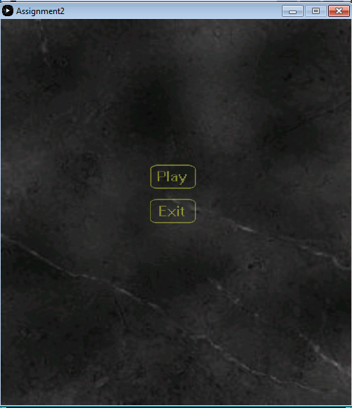
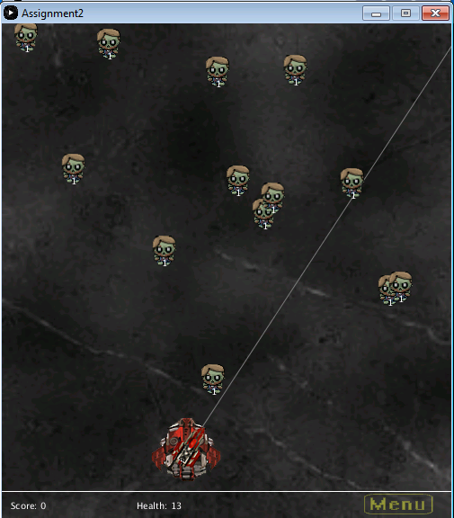
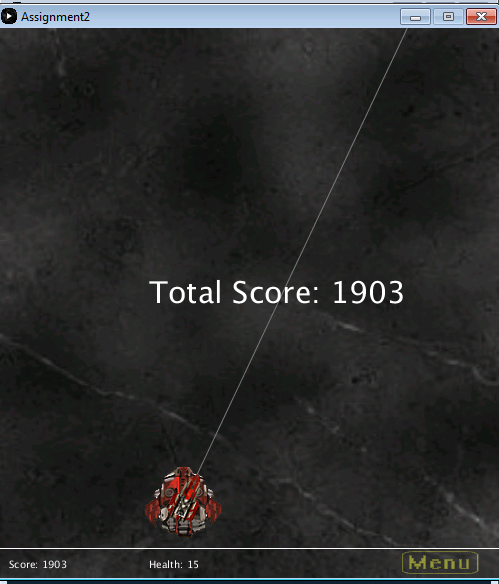
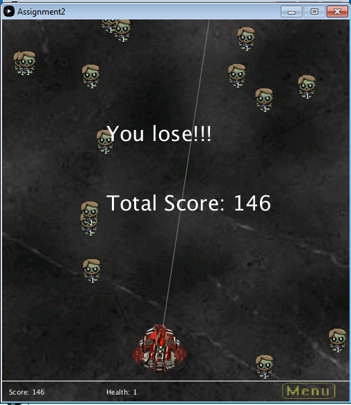

# Assignment2

Description: 
Making a game on processing

My plan:
A simple shooting game that shoots monsters to defend the base.

Game Menu - Pressing P to play, E to Exit, or hovering the mouse over.

Monsters spawning  and shoot them to get points/score.
Have 3 level with increase monsters and faster spawning.

Game Completion shows the total score you achieve.

You lose screen shows when your health becomes 0.

Resource:
Images

Player images
-edited and combined ship.

[Player image] (http://i.imgur.com/eivEB.jpg)

background 

[background image] (https://s-media-cache-ak0.pinimg.com/236x/6d/bf/e6/6dbfe6d75bf2051b5cf5e3079ce89f8d.jpg)

Zombies

Edited some png to fit in use.

[- Curt - cjc83486 images](http://opengameart.org/content/zombie-rpg-sprites)

Sound Clip

[Tank Firing Sound] 
(http://soundbible.com/1326-Tank-Firing.html)
[Zombie Gets Attacked Sound]
(http://soundbible.com/1040-Zombie-Gets-Attacked.html)
[Bite Sound](http://soundbible.com/950-Bite.html)
[Zombie Moan](http://soundbible.com/1035-Zombie-Moan.html)

